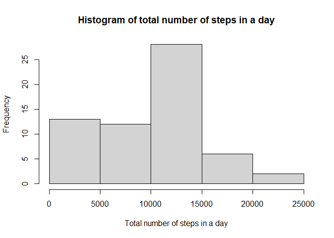
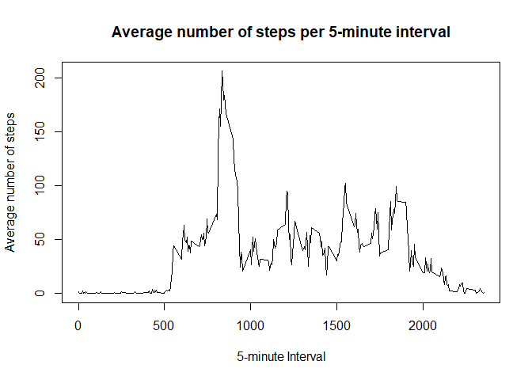
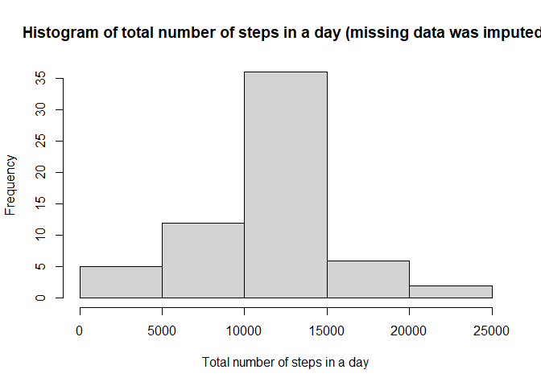
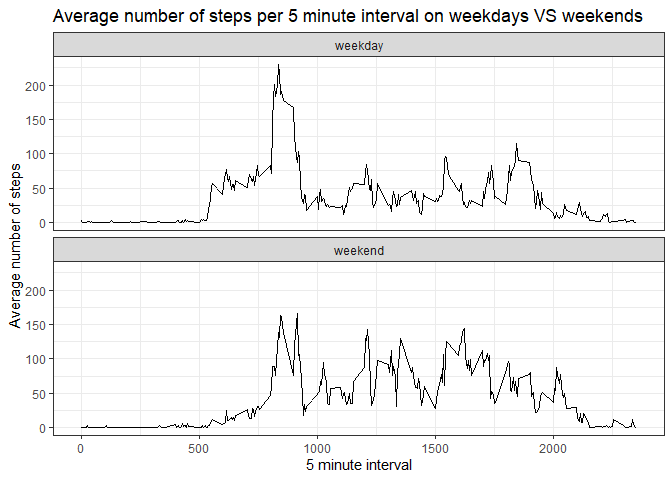

## Loading and preprocessing the data


```r
data <- read.csv(unzip("activity.zip"))
data$date <- as.Date(data$date, "%Y-%m-%d")
head(data)
```

## What is mean total number of steps taken per day?

### Calculate the total number of steps taken per day

```r
totalSteps <- tapply(data$steps, data$date, FUN = sum, na.rm = TRUE)
head(totalSteps)
```

```
## 2012-10-01 2012-10-02 2012-10-03 2012-10-04 2012-10-05 2012-10-06 
##          0        126      11352      12116      13294      15420
```

### Histogram of the total number of steps taken each day

```r
hist(totalSteps, xlab = "Total number of steps in a day", main = "Histogram of total number of steps in a day")
```

<!-- -->

### Mean and Median of the total number of steps taken per day


```r
# Mean
mean(totalSteps)
```

```
## [1] 9354.23
```

```r
# Median
median(totalSteps)
```

```
## [1] 10395
```

## What is the average daily activity pattern?

### Time series plot

```r
means <- aggregate(steps ~ interval, data = data,FUN = mean, na.rm = TRUE)
with(means, plot(interval, steps, type = "l", xlab = "5-minute Interval", ylab = "Average number of steps"))
title(main = "Average number of steps per 5-minute interval")
```

<!-- -->

### Maximum number of steps in a 5-minute interval

```r
# Maximum value
max(means$steps, na.rm = TRUE)
```

```
## [1] 206.1698
```

```r
# Time interval for this maximum
means$interval[which.max(means$steps)]
```

```
## [1] 835
```

## Imputing missing values

### Number of missing values

```r
sum(is.na(data$steps))
```

```
## [1] 2304
```
### Filling in missing values

We will fill missing values of a given interval by assuming that they are equal to the mean of the steps for that time interval, rounded to the closest integer number.


```r
# Create new data.frame
newData <- data

# Use the means already calculated to input the missing data
avgSteps <- round(means)
for (row in 1:nrow(avgSteps)) {
  newData[is.na(data$steps) & newData$interval == avgSteps[row, 1],1] <- avgSteps[row,2]
}

head(newData)
```

```
##   steps       date interval
## 1     2 2012-10-01        0
## 2     0 2012-10-01        5
## 3     0 2012-10-01       10
## 4     0 2012-10-01       15
## 5     0 2012-10-01       20
## 6     2 2012-10-01       25
```

### Histogram with the new dataset

```r
newTotalSteps <- tapply(newData$steps, newData$date, FUN = sum, na.rm = TRUE)
hist(newTotalSteps, xlab = "Total number of steps in a day", main = "Histogram of total number of steps in a day (missing data was imputed)")
```

<!-- -->

### Mean and median for the new dataset


```r
# Mean
mean(newTotalSteps)
```

```
## [1] 10765.64
```

```r
# Median
median(newTotalSteps)
```

```
## [1] 10762
```
As expected when we imput missing data that we were previously ignoring there is an increase in the mean and median of the number of steps per day.

## Are there differences in activity patterns between weekdays and weekends?

### Creating a new factor to distinguish weekdays from weekends

```r
newData$dayType <- factor(as.numeric(format(newData$date, "%u")) > 5, labels = c("weekday", "weekend"))
head(newData)
```

```
##   steps       date interval dayType
## 1     2 2012-10-01        0 weekday
## 2     0 2012-10-01        5 weekday
## 3     0 2012-10-01       10 weekday
## 4     0 2012-10-01       15 weekday
## 5     0 2012-10-01       20 weekday
## 6     2 2012-10-01       25 weekday
```

### Panel plot Weekdays vs Weekends


```r
par(mfrow = c(1, 2), oma=c(0,0,2,0))

weekdays <- aggregate(steps ~ interval + dayType, data = newData, FUN = mean, na.rm = TRUE)

ggplot(weekdays, aes(interval, steps)) + geom_line() + theme_bw() + facet_wrap(. ~ dayType, ncol = 1) + xlab("5 minute interval") + ylab("Average number of steps") + ggtitle("Average number of steps per 5 minute interval on weekdays VS weekends")
```

<!-- -->

We can see that on average activity starts earlier on weekdays than on weekends but on weekends there is more activity on average.
